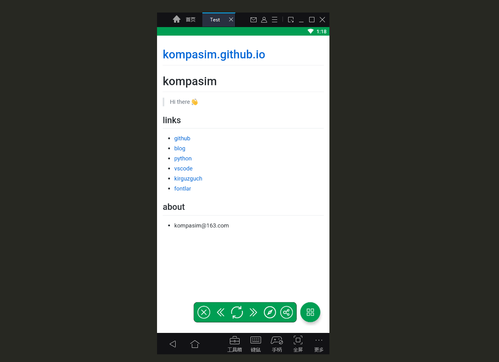

# android-web-app

0. Introduction

> this is a webview wrapper for android, you can build a app launching your website by default ...

1. Usage

* clone this repository
* change `main_web_page_url` to your target url in `string.xml`
* change app theme to your preferred color in `colors.xml`
* change app name and other tips in `string.xml`
* replace `drawable/android.png` to your preferred app icon
* then build it.

2. Features

* useful floating buttons
* fullscreen video support

3. Example

